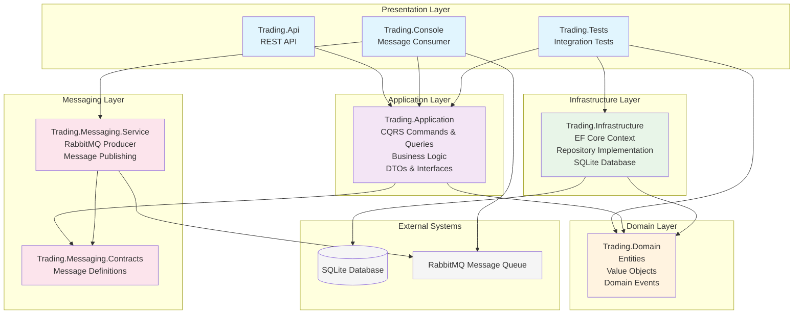

# Trading API Backend Microservice

A .NET 8+ backend trading microservice built with clean architecture principles, featuring REST APIs, message queues, and comprehensive testing.

## Architecture Overview

The solution follows Clean Architecture principles with clear separation of concerns across multiple layers:



## Project Structure

### Core Projects

#### **Trading.Domain** 
- **Purpose**: Core business entities and domain logic
- **Key Components**:
  - `Trade` - Main trading entity
  - `TradeId` - Value object for trade identification
  - `TradeAmount` - Value object for monetary amounts
  - `AssetSymbol` - Value object for asset symbols
  - `TradeExecutedEvent` - Domain event

#### **Trading.Application**
- **Purpose**: Business logic and use cases (CQRS pattern)
- **Key Components**:
  - **Commands**: `ExecuteTradeCommand` and handler
  - **Queries**: `GetTradesQuery` and handler
  - **DTOs**: Data transfer objects for API responses
  - **Interfaces**: Repository contracts

#### **Trading.Infrastructure**
- **Purpose**: Data access and external service implementations
- **Key Components**:
  - `TradingDbContext` - Entity Framework Core context
  - `TradeRepository` - Repository implementation
  - SQLite database configuration

#### **Trading.Messaging**
- **Purpose**: Message queue integration
- **Key Components**:
  - **Contracts**: Message definitions (`TradeExecutedMessage`)
  - **Service**: RabbitMQ producer implementation
  - Configuration for RabbitMQ settings

### API Layer

#### **Trading.Api**
- **Purpose**: REST API endpoints and HTTP layer
- **Key Components**:
  - `TradesController` - REST endpoints for trade operations
  - `TradeApiMapper` - Request/response mapping
  - Swagger/OpenAPI documentation
  - Dependency injection configuration

#### **Trading.Console**
- **Purpose**: Message queue consumer application
- **Key Components**:
  - RabbitMQ consumer for trade messages
  - Trade processing logic
  - Logging and monitoring

## Technology Stack

- **Framework**: .NET 8
- **Database**: SQLite with Entity Framework Core
- **Message Queue**: RabbitMQ
- **API Documentation**: Swagger/OpenAPI
- **Testing**: xUnit with FluentAssertions and Moq
- **Architecture**: Clean Architecture with CQRS pattern
- **Dependency Injection**: Microsoft.Extensions.DependencyInjection
- **Object Mapping**: Mapster

## Key Features

### Trade Execution Flow
1. **API Request** → `TradesController.ExecuteTrade()`
2. **Validation** → `TradeApiValidator.Validate()`
3. **Command Processing** → `ExecuteTradeCommandHandler.Handle()`
4. **Database Persistence** → `TradeRepository.AddAsync()`
5. **Message Publishing** → `RabbitMqTradeMessageProducer.PublishTradeExecutedAsync()`
6. **Consumer Processing** → Console app processes messages

### API Endpoints
- `POST /api/trades` - Execute a new trade
- `GET /api/trades` - Retrieve all trades
- `GET /swagger` - API documentation

### Message Queue Integration
- **Producer**: API publishes trade execution messages
- **Consumer**: Console app processes messages asynchronously
- **Message Format**: JSON with trade details and metadata

## Configuration

### Database
```json
{
  "ConnectionStrings": {
    "DefaultConnection": "Data Source=trading.db"
  }
}
```

### RabbitMQ
```json
{
  "RabbitMQ": {
    "HostName": "localhost",
    "Port": 5672,
    "UserName": "guest",
    "Password": "guest",
    "VirtualHost": "/"
  }
}
```

## Getting Started

### Prerequisites
- .NET 8 SDK
- Docker Desktop (for RabbitMQ)

### Running the Application
1. **Start RabbitMQ**:
   ```bash
   docker-compose up -d
   ```

2. **Run the API**:
   ```bash
   cd src/Trading.Api
   dotnet run
   ```

3. **Run the Console Consumer**:
   ```bash
   cd src/Trading.Console
   dotnet run
   ```

4. **Access Swagger UI**: https://localhost:7251/swagger

